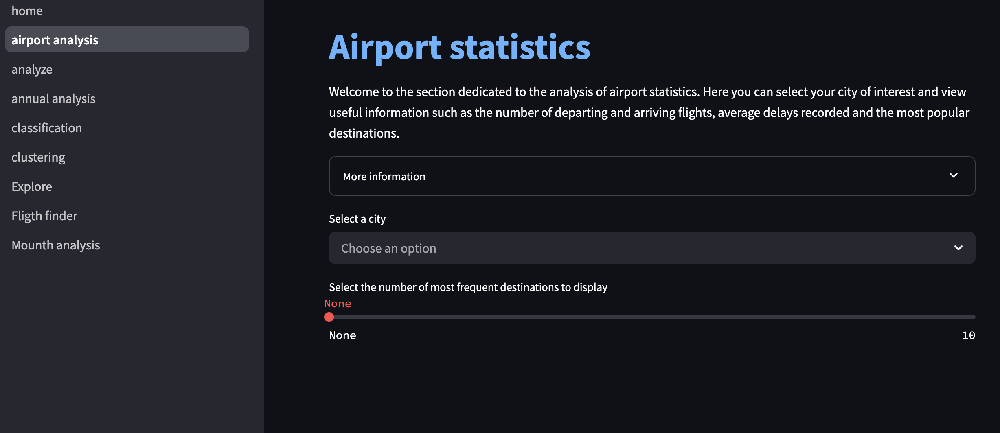

# ✈️ Air Flights Big Data @ Unical

[](https://github.com/umbertocicciaa/air-flights-big-data-unical/actions/workflows/airflights.yml)

Analyze and visualize air traffic data at scale using a modern big data stack. This project demonstrates distributed processing with Hadoop and Spark, real-time analytics with Redis, and containerized orchestration via Docker.

---

## 📊 Demo



---

## 🚀 Features

- Distributed data processing with **Apache Spark**
- HDFS storage via **Hadoop**
- Data warehouse storage via **Hive**
- In-memory caching and messaging using **Redis**
- Scalable and isolated setup via **Docker Compose** or **K8S**

---

## 🧱 Project Structure

```
air-flights-big-data-unical/
├── src/                    # Application code and environment settings
├── run.sh                  # Script for local (non-Docker) execution
├── docker-compose.yml      # Multi-service Docker configuration (DEV)
├── docker-compose-prod.yml # Multi-service Docker configuration (PROD)
├── src/Dockerfile          # Base image for application container
└── resources/              # Static assets and demo images
```

---

## ☸️ Run with K8s

### Prerequisites

- [Kind Cluster](https://kind.sigs.k8s.io/)
- [kubectl](https://kubernetes.io/docs/reference/kubectl/)

### Usage

```bash
chmod u+x kind.sh
./kind.sh
```

Or if you have a local kind cluster

```bash
kubectl -f apply k8s/
```

This will spin up all required services (Hadoop, Hive, Spark, Redis, App) automatically.

---

## 🐳 Run with Docker Compose

### Prerequisites

- [Docker](https://www.docker.com/)
- [Docker Compose](https://docs.docker.com/compose/)

### Usage

```bash
docker compose up --build
```

This will spin up all required services (Hadoop, Spark, Redis, App) automatically.

---

## 💻 Run Locally (Manual Setup)

### Prerequisites

- Python 3.x
- Redis
- Apache Spark
- Apache Hadoop
- Java JDK (8 or 11)

### Steps

```bash
# Clone the repository
git clone https://github.com/umbertocicciaa/air-flights-big-data-unical.git
cd air-flights-big-data-unical

# Set JAVA_HOME in src/local.env to your JDK 8 or 11 path
# Example: JAVA_HOME=/usr/lib/jvm/java-11-openjdk

# Make script executable and run
chmod u+x run.sh
./run.sh
```

---

## 🧪 Dev Notes & Resources

> Optional: Only for manual setup or troubleshooting on local environments.

- [Installing Hadoop on macOS M1/M2 – Medium Guide](https://medium.com/@MinatoNamikaze02/installing-hadoop-on-macos-m1-m2-2023-d963abeab38e)
- [Setting up Apache Spark on macOS – Medium Guide](https://medium.com/@le.oasis/setting-up-apache-spark-on-macos-a-comprehensive-guide-78af7642deb1)

---

## 📄 License

This project is licensed under the MIT License. See the [LICENSE](LICENSE) file for more information.

---
